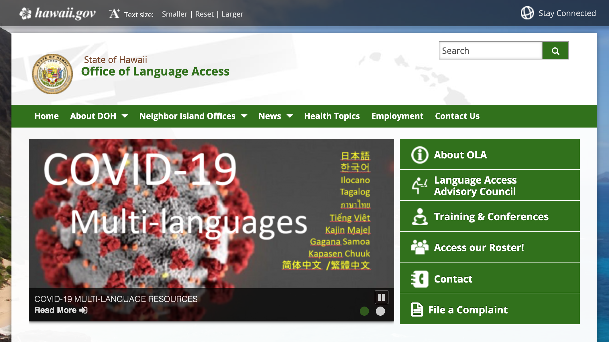

## DH110 
## Yi Ren
## Assignment 01: Heuristic Evaluation
---
### Project Description

In this project, I aim to analyze how the website of Hawaii government functions as a guide to its services on language access, linguistic diversity, as well as natural and cultural heritage protection. As the government of a state with citizens from diverse linguistic and cultural backgrounds, the government of Hawaii is responsible for providing support to those from the under-resourced groups, and the website of the government is supposed to offer clear and accurate information as well as user-friendly instructions on where and how to seek help. 

---
### Heuristic Evaluation of the Official Website of Office of Language Access of Hawaii State 

https://health.hawaii.gov/ola/
 

First of all, my motivation for choosing to analyze the website of the Office of Language Access (OLA henceforth)is my interest in how the Hawaii government provides support for those who are Hawaii citizens but not native English speakers. According to the "about page" of the OLA "works to ensure that persons who do not speak, read, write, or understand English are able to access services, programs and activities provided by: State government agencies, courts, and schools; and State-funded organizations, including medical and social service providers". 

I think the OLA website fulfills the most heuristics overall. 

The system status of the website is quite visible, as all the links on the website are clearly marked with different font sizes or underlined texts. In addition, the navigation bar on the top is also marked with multiple arrows pointing down, indicating that there are dropdown menus. 

The system and the real world are also matched well, as all the language used on the website is easy to read through. However, I found that the website not only provides an English version, but also offers a variety of other languages as an office that aims to help those who do not read or speak English. I found the translations into languages consistent with the purpose of the office. 

Users also have freedom and control when browsing the site, as the link back to the home page is always visible. 

The website maintains consistent standards overall, but the preference of language button is not very eye-catching, though that might be one of the most important functions of the website. 

I think the error prevention of the website is generally satisfying, as the links are all marked clearly and are separated from each other, which prevents unintentional slips. 

The navigation bar and the links of the website are marked in different ways to help users recognize instead of recalling each time when browsing the site. 

The website is not designed as a very flexible one, as there is only one link to each webpage and the users hardly have other ways to navigate. 

The website follows a minimalist design, as there is only necessary information available on the site. However, I found the sizes of the pictures and the texts on the website are not balanced very well. 

The error messages of the website are not very clear, as one picture of an official of the OLA seems to be absent, but there is no clear error message beside it. 

The search bar is quite visible at the right top corner of the website, so I think the website also does well in help and documentation. 

I would rate the severity of issues as one, as mostly the website follows the principles of the 10 heuristics. 

--- 
### Heuristic Evaluation of the Government Website of Kauai County 
http://www.kauai.gov/
 

The website of the Kauai government provides information on the responsibilities, policies, services, and organization of the county government. 

The system status of the website is rather visible, as the navigation bar on the top and other links all have high visibility. 

The system and the real world are also matched well, as the website mainly uses user-friendly language. 

Users also have freedom and control when browsing the site, as the link back to the home page is always visible. 

The website does not maintain consistent standards very well, because the links that are supposed to serve different functions are marked in the same way, which might make it hard for users to distinguish. For example, the navigation bar on the left side of the website uses the same underlined blue texts as other links on the website. 

The error prevention of the website is not very effective either, as it lacks useful constraints to prevent users from clcking links by mistake. In addition, the default visual center is the gallery of pictures of Kauai, but there are no links attached to the pictures, which might cause users confusion when they try to click on the most eye-catching element of the website. 

The recognition of the website menus and links is also hard to achieve, as most of the links look too similar to each other. 

The flexibility of the website is not very high because there is only one way to navigate to each page. 

The website follows a minimalist design, but I think the problem is that it is so simple that a lot of necessary information is not available. 

The website does not give any error message when I was browsing, so I was not sure whether the website provides useful diagnosis and recovery of errors. 

There is an obvious search bar on the website, so the help function of the website is satisfying. In addition, the search bar uses the conventional magnifier symbol, and is positioned at the right top corner of the website, which is also the conventional location of search bars on most websites, so I think in that regard, it does help users recognize instead of having them recall. 

My severity rating of this website is 2. 
