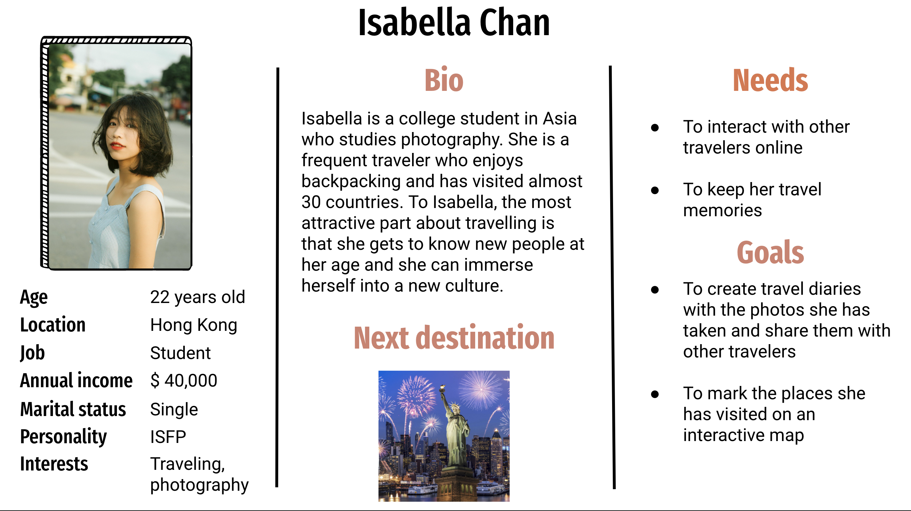
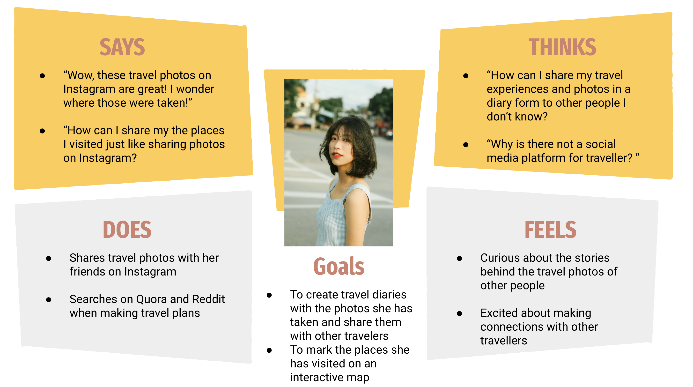
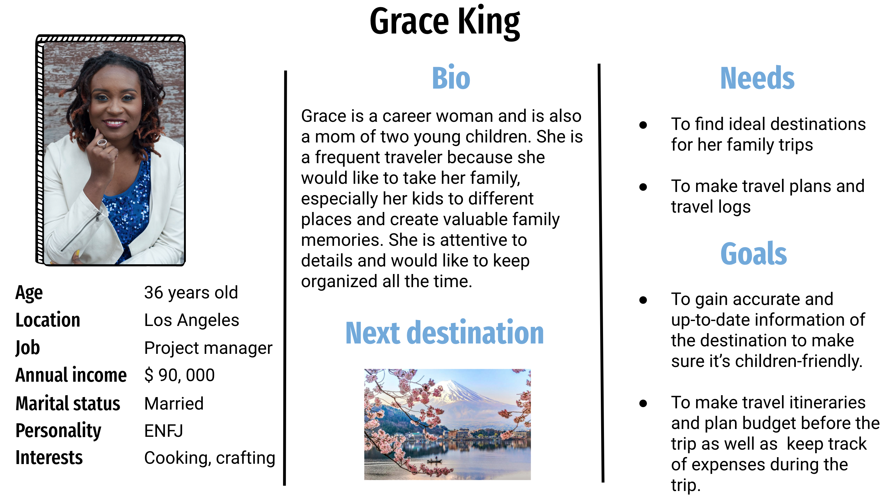
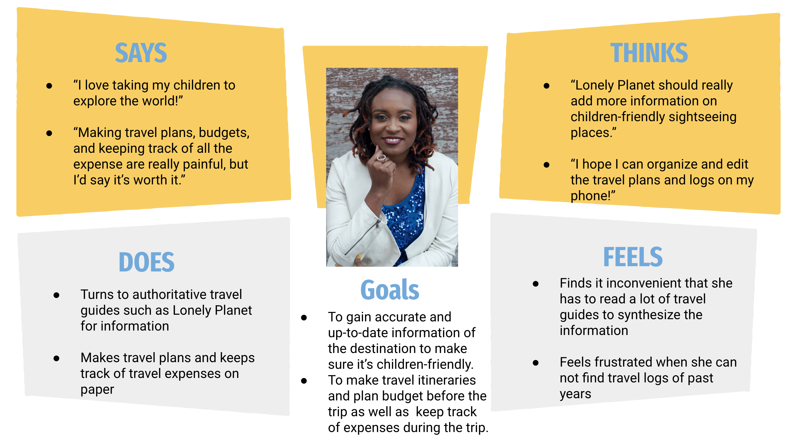
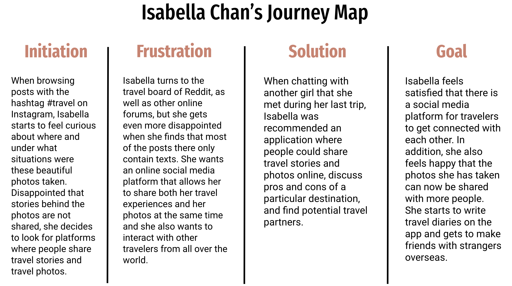
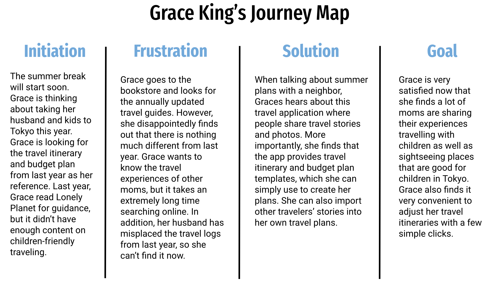

## DH110 
## Yi Ren
## Assignment 04: Persona and Scenario 
---
## The Purpose of UX Storytelling 

The purpose of UX storytelling in general is to first of all identify the potential target users of the design and thus to examine the design from the perspective of the users. The first goal of my UX storytelling is to create personas that represent the potential users of my design, which is a website that helps travellers create and share travel plans based on accurate and up-to-date information. The second goal of my UX storytelling is to generate possible scenarios in which the potential users may find the design helpful. With UX Storytelling, I intend to put myself in the potential users' shoes and try to visualize their needs and challeges.

## Design Features 
* An interactive map that allows people to browse pictures taken at the destination, which further link to the destination and the travel diaries of users. 
* A travel itinerary template that allows people to extract information from the travel stories of other users and add it to self-created travel plans. 

## Persona and Empathy Map of Isabella Chan

## Persona and Empathy Map of Grace King 

## Scenario 1 with Isabella Chan 
### Why 
Isabella is a college student in Asia who studies photography. She is a frequent traveler who enjoys backpacking and has visited almost 30 countries. Isabella is also familiar with the use of social media apps. She frequently uploads her travel photos to Instagram, and she also enjoys browsing other people's photography. However, she has been disappointed that on Instagram, people rarely share the stories behind the photos. It's also a little intimidating to reach out to strangers and ask them about their travel stories. She then turns to online forums, such as Reddit, but realizes that people tend to share travel experiences only in texts there. Isabella is looking for a platform that allows her to share her experiences creatively and interact with other people. 

### How
After talking with her friend, Isabella downloads the travel app. What she sees first is an interactive world map with a search bar on the top. Isabella inputs "New York" in the search bar, and the world map turns to the local map of New York. Isabella zooms in the map with fingers, and she finds all kinds of sightseeing places marked on the map. She uses her fingers to move around the map and finds the Statue of Liberty. When Isabella touches the mark on the map, a new window pops up. On the new window, Isabella sees the basic information of the Statue of Liberty, such as open hours, as well as a variety of pictures taken by other travelers at the place. She then touches one of the pictures, and then she sees the publishing date and author of the picture, as well as a link that says "see full travel diary". When Isabella touches the link, she accesses the complete travel diary of the author's New York trip. While scrolling down the diary, she finds that she can highlight certain parts and leave comments. Isabella then touches the user icon on the top right corner of her screen and creates an account. She finds that now she can also create travel diaries with photos and share them with more people. 

## Scenario 2 with Grace King 
### Why 
Grace is a project manager of a local company in Los Angeles. She is a career woman as well as a mom of a five-year-old and a ten-year-old. She enjoys traveling with her kids. As the summer break is approaching, she is discussing with her husband about taking their kids to Japan. However, when she looks for travel guides in a bookstore, she finds that these guides are not very up-to-date and do not have enough content on family-friendly attractions or information on what they can do with their kids. In addition, she is frustrated that the hard-copy travel itineraries she made last year were misplaced by her husband.

### How
After talking with her neighbor, Grace downloads the travel app. What she sees first is an interactive world map with a search bar on the top. When Grace inputs "children-friendly" in the search bar, the results appear on the world map in the form of drawing pins. Grace sees a number of drawing pins around Japan, her next destination. She zooms in and touches a drawing pin on the local map of Tokyo, and a new window pops out. The new window shows the name of the specific sightseeing attraction, its basic information, photo gallery, and extractions from other people's travel diaries that include the keyword "children-friendly". Grace is happy to see the travel experiences of other moms. She then creates an account. On her own page, Grace finds a plus sign at the center of her screen. She touches the plus sign and a few options pop out, including travel diary, itinerary, budget plan, and travel log. She touches "itinerary" and a series of default templates pop out for her to choose from. 

