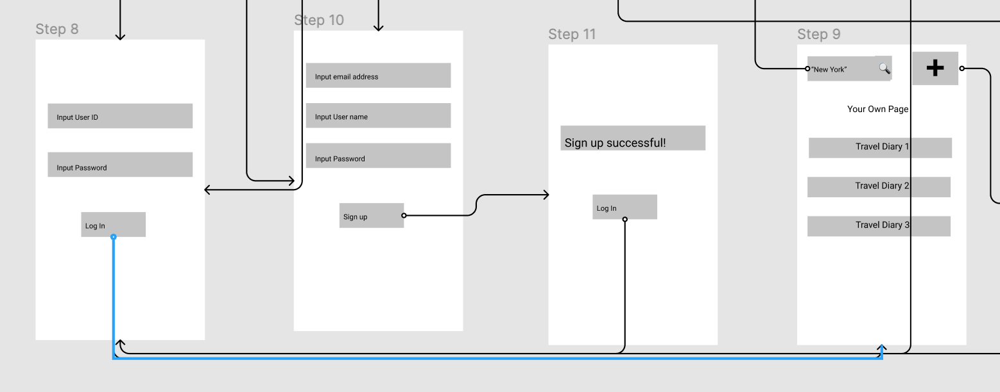

## DH110 
## Yi Ren
## Assignment 05: Low-Fidelity Prototype 
---
## The Purpose of Prototype 
The purpose of designing and testing the low-fidelity prototype is to gain insights from potential users to assess whether the current design is easy to interact with. More importantly, the low-fidelity prototype allows the designers to create an initial sketch of the ultimate design in a low-cost and less time-consuming way. Furthermore, during the test, the designers are able to identify potential design errors and further improve the design by reflecting on where the users get confused or get stuck. 

## Summary of User Research 
The project aims to provide solutions to travelers with an application that integrates the functions of a travel guide and a trip planner. 

## Summary of Persona 
The designer created two personas. The needs of the first persona is to interact with other travelers oneline and share her own travel memories. The needs of the second persona is to find ideal destinations of her family trip and to make trip plans, budget plans, and travel logs. 

## Summary of Design Features 
### Task 1 
An interactive map that allows people to browse pictures taken at the destination, which further link to the destination and the travel diaries of users.

> What the user sees first is a search bar at the center of the screen. When the user inputs the destination, such as "New York", in the search bar, the user is able to find all kinds of sightseeing places marked on the an interactive map. The search bar is then moved to the top. When the user touches one of the marks on the map, the "Satute of Liberty", a new window pops up. On the new window, the user sees the basic information of the Statue of Liberty, such as open hours, as well as a variety of pictures taken by other travelers at the place. The user then touches one of the pictures, and then she sees the publishing date and author of the picture, as well as a link that says "see full travel diary". When Isabella touches the link, she accesses the complete travel diary of the author's New York trip. 

### Task 2 
A travel itinerary portal that allows people to create, edit, and manage their travel plans.

>After logging in, On the user's own page, they can find a plus sign on the top. She touches the plus sign and a few options pop out, including travel diary, itinerary, budget plan, and travel log. When the user touches "itinerary", a series of default templates pop out for her to choose from.

## Wireframes and Wireflows 
Please find the wireframes and the wireflows [here](https://www.figma.com/file/Zd7uHoFcbqqITYlIWeqtld/DH110-Assignment06)
## Prototype Testing 
### Task 1 

> What should I do with the search bar? Should I just pretend that I can input a destination? 

> So the red circle means that I should click on it? 

> For the "back" button, do I go back to the map or? 

### Task 2

> So I'll go back to the search results of "New York" even though I didn't log in when I searched? 

## Reflection 
The test went smoothly overall. During the test, confusion mostly occurred when the participant was trying to find out how to interact with the design. For instance, the participant was having a hard finding out how to interact with the search bar. In addition, the participant also found some of the buttons confusing because they were not specific enough. For instance, at Step 4 of Task 1, the participant was not sure whether the "back button" links back to the interactive map or the photo gallery. Another similar error occurred at Step 5 of Task 2, when the participant was distracted by the search bar on the top because she was not sure whether she could go back to the original search results, which was actually from Task 1. Reflecting on the test results, I will try to improve the prototype by making the interaction methods more clear and making the button labels more specific. 

