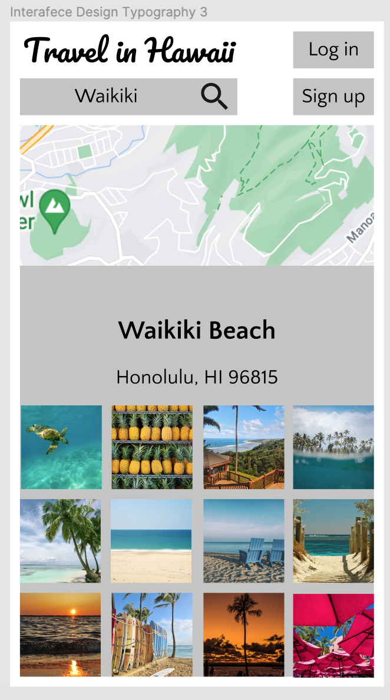

## DH110 
## Yi Ren
## Assignment 06: Interface Design 
---
## Project Description 
During the initial contextual inquiry, I found that while travelers would like to turn to government website for accurate and official informatino, such as health protocals during the pandemic, they still tend to brwose travel forums to know about the travel experiences of previous visitors. Thus, I would like to design an application to combine the functions of official travel guides and travel forums targeting the potential tralvelers who are interested in visiting Hawaii. First of all, this application aims to keep synchronous with the official government website and provide accurate and up-to-date travel information for visitors. Specifically, the application aims to allow travelers in Hawaii to browse sightseeing attractions, upload travel photos and diaries, and interact with other travellers. In addition, the application also aims to help potential travellers to Hawaii create and manage their itineraries, budget plans, and travel logs.

---
## Digitized Wireflow 
Please find the digitized wireflow [here](https://www.figma.com/file/Zd7uHoFcbqqITYlIWeqtld/DH110-Assignment06). 

---
## Interface Design Variation 

### Layout
I set the layout with 14 rows and 8 columns as shown in the picture below. I tried to set the layout with more rows than conclumns as the wireframes are designed for display on mobile phones and in this way I could make square-like grids. In addition, smaller, square-like grids would allow me to have buttons of a relatively small size. 

I set the gutter and margin both as 10, because I wanted to keep the distance between the elements and the distance from the border of the screen consistent. 

### Typography 
#### Variation 1 
The first typerface familites I chose include Pacifico for the brand name and Karla for the rest of the text, including body text, button label, and caption. I would like to display the brand name in an significantly different typerface in order to make it eye-catching enough so that users may recognize it. For the rest of the text, I would like to make it consitent so that the interface can be displayed in a simple, minimalistic style. Thus, I chose Karla, which looks quite similar to the font on the official government of Hawaii. 

I set the brand name to size 30px to make it prominent. I then set the title to 26px and the body text and label button to 20px. 

It seems that the brand name font is satisfying. For the rest of the text, the size and the default line height also seems satisfying. However, the letter spacing of Karla seesm to be a bit too wide, so I then tested other typeface familiers.

#### Variation 2
The second typerface family I chose for body text and button label is Asap. The letter-spacing is satisfying this time, but when I tried to make the title bold, it seems that the font looks too thick and becomes more difficult to read. Thus, I chose not to use this typerface. 

#### Variation 3
The third typerface I chose was Quattrocento Sans, which seemed the most ideal so far. First of all, the typerface is not too square-shaped, which makes it suitable to the travel theme of the applicaiton. In addition, since I would like to make the title bold, I also need a font that is not too dark or thick when in bold, and Quattrocento Sans seems satisfying.  in the current page, there is not multiple-line paragraph, but I will set the line-spacing to 1.5. For padding, I decided to locate the text to the center of the button, and the margin is thus dependent on the size of the text box. 

---

### Shape 
#### Variation 1 
First of all, I chose three different roundness settings for different elements on the page. I set the roundness of the search box to 20, that of the buttons to 10, and that of the overlay to 0. I originally thought that having distinc roundness settings may help users distinguish different funcitons, but I felt that actually it looked quite inconsistent. 

#### Variation 2
Therefore, I set the roundness of all the elements to 10, and I think it seemed much more consistent this time. Nonetheless, I also found that the bottom corners of the overlay (the search result), the interactive map, and the photo gallery all overlap with each other, I had to set the roundness of all of thoese corners to 10. In this way, I found it also inconsistent as only the bottom corners of bottom left photo and bottom right photo have a roundenesss setting of 10, and the corners of all the other photos above are still in a square shape. Thus, I decided to test the roundness setting of other photos as well. 

#### Variation 3
Thus I chose to make the roundness of all the elements to 10, including the search box, the interactive map, the overlay of search results, the buttons, as well as the photos to make the style consistent. 

---
### Bright Color Mode
I excracted five colors from the logo and the color theme of the official Hawaii government website. 

#### Variation 1 
I adapted color #FEF9EF, which is the background color the Hawaii logo, as the background color of the page, as it is already very bright. I adjusted the brightness of the color #708E20 and got #1F2904 as the primary color. I then adjusted the brightness and satuation of #E0C389 to make a focus color. 

#### Variation 2
It turns out that the first color theme seems too monotonous, so I tried the other colors from the color theme extracted from the Hawaii logo. I tried to choose different colors for the search box and the log-in buttons to make them noticeable. I also chose a less bright and satuarated background color for the overlay in order to make a contrast with the photos. 

#### Accessibility Check 
All the elements on the page passed the level AAA ratio of color contrasts.  

---
### Dark Color Mode

#### Accessibility Check 
All the elements on the page passed the level AAA ratio of color contrasts except for the search box, which passed the level AA ratio. 

---
## Impression Test 
I  presented both the bright mode and dark mode interfaces to the participant and she told me that overall the color themes and the shapes looked good. Specifically, she said that she liked the rounded corners of the buttons and the style of the fonts, especially the font of "Travel in Hawaii". Nonetheless, she 抵did mention that the background color of the photo gallery look similar to the color of sand, which made it not contrastive enough with the pictures of beach. In addition, she also mentioned that the corners of the photos in the photo gallery might be too rounded that they looked like clickable icons instead of photos. Regarding the dark mode, the participant said that it looked satisfying, except for the interactive map, which was a little inconsistent as it was too bright. 

## Update based on Impression Test 
Based on the feedback of the participant, I changed the roundness setting of the photos in the photo gallery back to 0 to avoid users from recognizing them as icons. I also changed the background color of the overlay to make a shaper contrast with the photos. The contrast of the new background color and the text still passed the level AAA ratio. 

---
## Final Interface Design Page 
Please find the final version of the interface design page [here](https://www.figma.com/file/eiAJlyZpljX0ExSSnHuCWu/DH110-Assignment06?node-id=2%3A5).  
The detailed information of the interface design system is:
### Typography 
Typeface of brand name: Pacifico

Typerface of text: Quattrocento Sans

Brand name size: 30

Body text size: 20

Title text size: 26

Button label: 20

Caption: 20

Letter-spacing: Default

Line-spacing: 1.5

Padding: Center alignment 

### Shape 
Roundeness setting of buttons: 10

Roundeness setting of interactive map: 10

Roundeness setting of search result overlay: 10

Roundeness setting of photos: 0 

Roundeness setting of bottom left photo: 10 for the bottom left corner, 0 for the rest 

Roundeness setting of bottom right photo: 10 for the bottom right corner, 0 for the rest 

### Bright Color Mode 
Background color of frame: #FCFAED

Primary color: #1F2904

Focus color of search box: #CFDBAD 

Focus color of log-in button: #FFDD6E

Background color of overlay: BAB5AB

### Dark Color Mode 
Background color: 1F2904

Primary color: #FCFAED

Focus color of search box: #585E48

Focus color of log-in button and overlay: #54524E

### Layout 
8 columns and 14 rows 

Gutter: 10 

Margin: 10 

