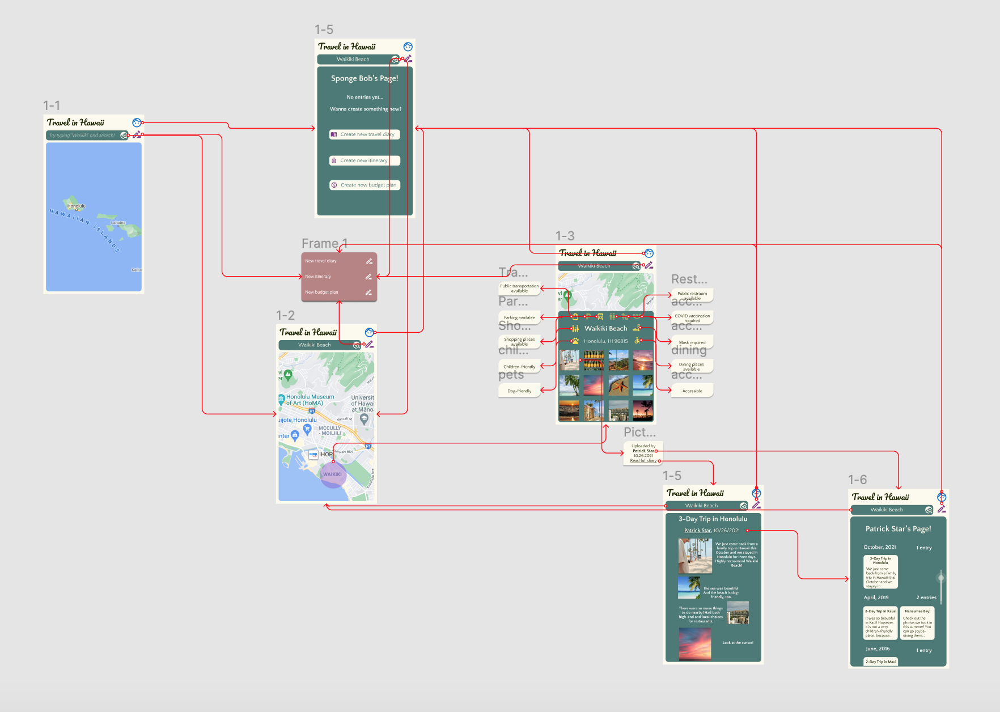
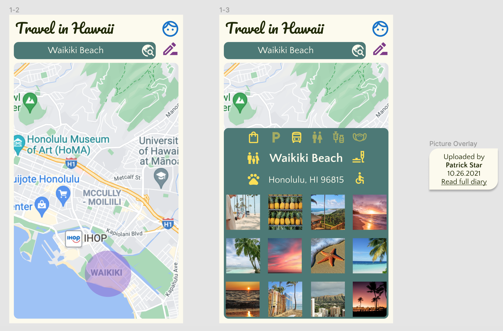
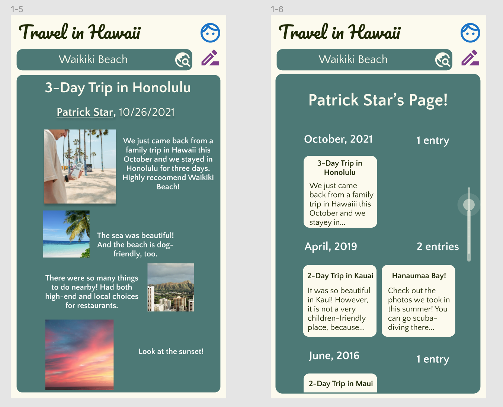

## DH110 
## Yi Ren
## Assignment 07: High-Fidelity Prototype 
---
## Purpose of Project 
For this project, I designed a smart phone application for the official government of Hawaii that targets at the potential travelers who are interested in visiting Hawaii. First of all, this application aims to provide updated and accurate information on sightseeing attractions for visitors, such as whether the sightseeing locaiton is accessible, whether masks or vaccination records are required, or whether the place is family-friendly. Specifically, the application aims to allow travelers in Hawaii to browse sightseeing attractions as well as upload travel photos and diaries of their own. In addition, the application also aims to help potential travellers to Hawaii create and manage their itineraries, budget plans, and travel logs.

The interactive prototype was developed based on the low-fidelity prototype. In the interactive prototype, potential users may create travel diarties, look for sightseeing places on a map, check information, and browse the travel pictures and diaries of other travelers.  

## Tasks
### Task 1 
> Potential users will be able to view their own travel blog page and create travel diaries, budget plans, and itineraries. The users will also be able to create these files by clicking on a "pen" icon on the top right corner of the screen. 

### Task 2 
> Potential users will be able to search for specific sightseeing locations in Hawaii, view them on an interactive map, check the accurate and updated information about the locations, such as health protocals, as well as check the photos and travel diaries of other travelers that have been uploaded to the page. 

## Wireflow with Interface Design 
Plesase check the wireflow with the interface design [here](https://www.figma.com/file/QOjbM6N4G981K4gHLX7D6X/DH-110-Assignment-07?node-id=0%3A1).

## Graphic Design 
Here is the graphic design of the high-fidelity prototype. Most of the elements are the same with the initial interface design, but I changed the log-in and sign-up buttons into one button, represented by a "person" icon. I also added an additional button on the right top corner of the screen, which allows users to create travel diaries, budget plans, and itinearies without navigating to their personal blog page first. 

I also changed the color theme of the application. While the background color and the text color are the same, I set the background of the overlay with a dark green color to cater to the theme of nature. 

I also added two new colors to the color theme for the "user account" button and the "create travel diaries" buttons to make them noticeable enough. All the new colors have passed the WCAG2.0 AA level color contrast (3:1) (I chose the 3:1 ratio because all the new colors were added for buttons without small-font texts). 

## Interactive Prototype 
Plesase check the interactive flow [here](https://www.figma.com/file/QOjbM6N4G981K4gHLX7D6X/DH-110-Assignment-07?node-id=0%3A1). 

The interactive prototype is located to the right of the wireflow. 

## Cognitive Walkthrough 
I received feedback on the cognitive walkthough from two classmates and I also recruited one additional participant. The cognitive walkthrough was conducted online. I showed the participant the interactive prototype and used the following four questions to evaluate the walkthrough. 

>Will the user try and achieve the right outcome? Will the user notice that the correct action is available to them? Will the user associate the correct action with the outcome they expect to achieve? If the correct action is performed; will the user see that progress is being made towards their intended outcome?

## Revision 

