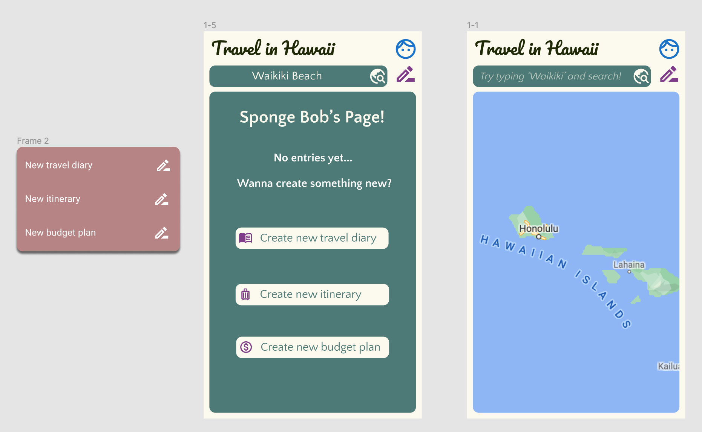
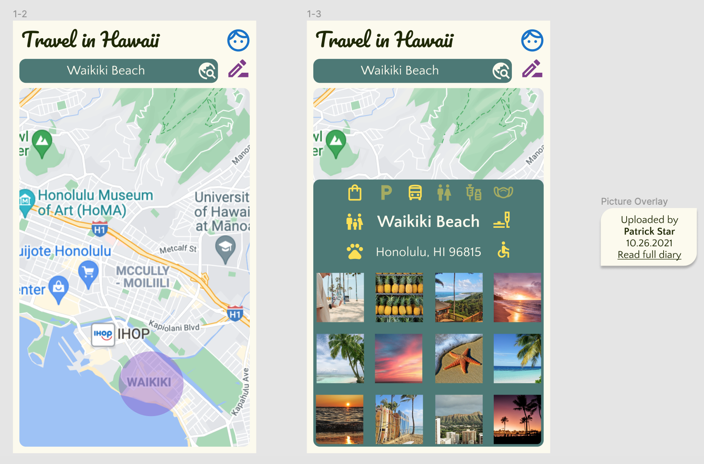
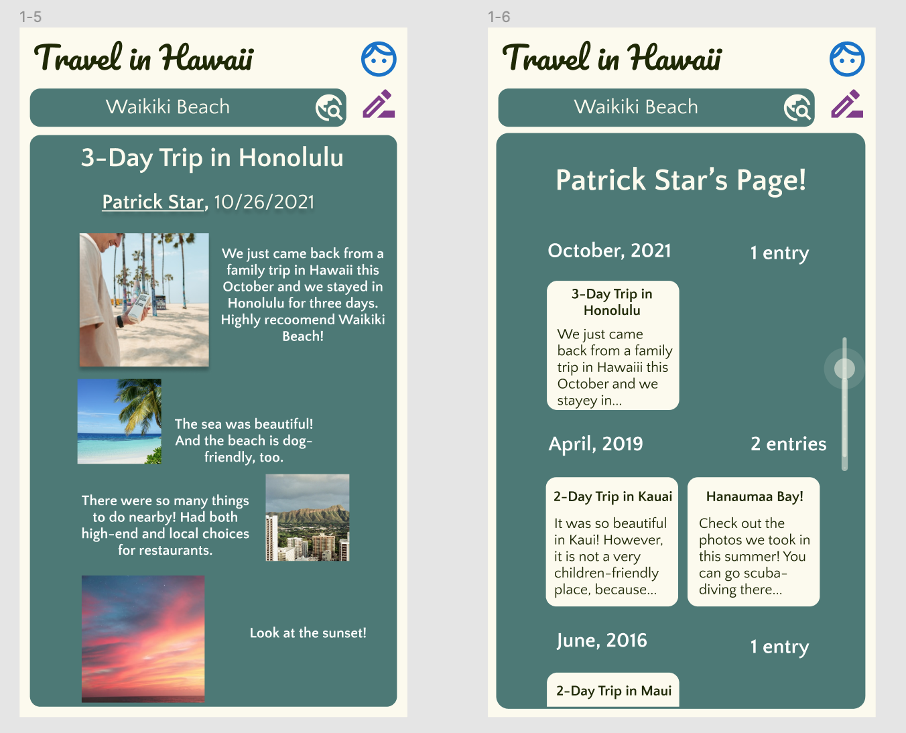

# Travel in Hawaii 
## Yi Ren

### Introduction: a brief information about the project. 
What is the project about? The motivation of the project and possible contribution.

### Clear design statement: 
What is the issue and Why do you think it is important to resolve that issue by your project? 

### Competitor analysis [assignment01 & 02]:
Summary and link to the heuristics and usability testing of the *existing* product(s) - or the *original* website you evaluated

## User research [contextual inquiry, assignment03]:
Summary and link to your assignment folder

### UX storytelling [persona+scenario, assignment04]
Summary and link to your assignment folder

###  Wireframe and graphic design element variation [assignment05 + part of 06]

### Low-fidelity prototype (wireflow, assignment06)
Summary and link to the sketches (may contains the multiple versions and evaluation history)

### High-fidelity prototype (functional/interactive prototype, assignment07)
Summary statement and link to or an embedded prototype

<iframe style="border: 1px solid rgba(0, 0, 0, 0.1);" width="800" height="450" src="https://www.figma.com/embed?embed_host=share&url=https%3A%2F%2Fwww.figma.com%2Ffile%2FJ6v3tDVyvBXsvCHMO4oEHy%2FDH-110-Assignment-07-second%3Fnode-id%3D0%253A1" allowfullscreen></iframe>

### Optional evaluation and revision history 
Including cognitive walkthrough; impression test, accessibility audit, usability testing), per each summary and link to the notes (when you share the video or other detailed evidences, I will notify you when you can make the contents private as soon as your work is graded)

###  Pitch video [update the video after recording your presentation]

### conclusion: what you learned throughout the process
